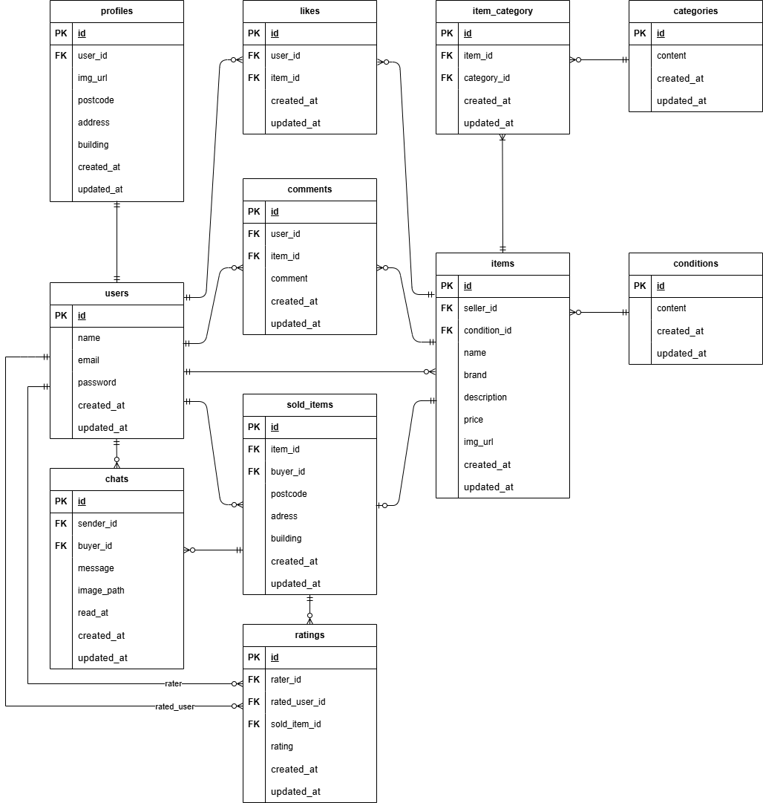

# アプリケーション名

フリーマーケットアプリ

## 概要

本アプリケーションは、個人間で商品の売買（フリマ）を行うための Web アプリケーションです。ユーザーは商品の出品、購入、取引相手とのコミュニケーション、評価などを行うことができます。

## 環境構築

### 前提条件

-   Git
-   Docker
    > コンビニ支払いのテストをする場合は以下の条件も満たす必要があります。
-   Stripe アカウントを持っていること。
-   Stripe ダッシュボードから API キー（公開可能キーとシークレットキー）を取得できること。

### Docker ビルド

-   `git clone git@github.com:yoshi-bell/coachtech-fleamarket.git`
-   `cd coachtech-fleamarket`
-   `docker-compose up -d --build`

> MySQL は、OS によって起動しない場合があるのでそれぞれの PC に合わせて`docker-compose.yml`ファイルを編集してください。

### Laravel 環境構築

-   **`php`コンテナに入る**

    -   `docker-compose exec php bash`

    > これ以降のコマンドは、コンテナ内で実行します。

-   **パッケージのインストール**
    -   `composer install --dev`
-   **`.env.example` ファイルから `.env` ファイルを作成し環境変数を変更**
    -   `cp .env.example .env`
-   **アプリケーションキーの生成**
    -   `php artisan key:generate`
-   **データベースのマイグレーション**
    -   `php artisan migrate`
-   **ダミー画像のコピー**
    -   `php artisan setup:copy-images`
        > このコマンドにより、初期データ投入（シーディング）で使用されるダミーの画像ファイルを、適切なディレクトリにコピー。
-   **データベースの初期データ投入**
    -   `php artisan db:seed`
        > シーディングにより、商品のダミーデータ 10 種類、ユーザーのダミーデータ 3 件がデータベースに入力されます。
-   **ストレージのシンボリックリンク作成**

    -   `php artisan storage:link`

-   **（任意）`storage`ディレクトリの権限設定**
    -   "The stream or file could not be opened"エラーが発生した場合に実行します。
    -   `chmod -R 777 storage`
        > **注意:** `777`は全てのユーザーに読み書き実行を許可する最も緩い権限設定です。これはローカル開発環境での権限問題を簡易的に解決するためのもので、本番環境では使用しないでください。

### 決済サービス stripe によるテスト環境構築

-   **Stripe API キーの設定**

    -   Stripe ダッシュボード（開発者設定 -> API キー）から取得した以下のキーを`.env`ファイルに設定。
        -   `STRIPE_KEY="pk_test_..."`
        -   `STRIPE_SECRET="sk_test_..."`
            > 以上の設定でクレジット支払いでの決済テストが可能。コンビニ払い決済テストの設定は以下。

-   **Docker を再ビルドし`.env`ファイルの変更を反映**

    -   `docker-compose down`
    -   `docker-compose up -d`

-   **Stripe CLI をインストール**

    -   使用 OS に合わせて、以下の公式ドキュメントを参考にインストール。
        -   (https://stripe.com/docs/stripe-cli)

-   **決済機能テスト**
    -   後述の「決済機能テスト」を参照。

## アプリケーションの機能

このアプリケーションは、フリマサイトを管理するためのシステムです。主な機能は以下の通りです。

-   **会員登録・ログイン機能**:
    -   ユーザーはメールアドレスとパスワードで会員登録・ログインが可能です。
    -   **メール認証機能**: 新規会員登録時にメール認証を行い、未認証ユーザーは保護されたページにアクセスできません。
    -   認証メールの再送機能も備えています。
-   **商品一覧表示**:
    -   全商品の表示、商品画像、商品名、価格の表示。
    -   購入済み商品は「Sold」と表示されます。
    -   いいねした商品や購入した商品の一覧も確認できます。
-   **商品検索機能**:
    -   商品名での部分一致検索が可能です。
-   **商品詳細の確認**:
    -   商品画像、商品名、ブランド名、価格、いいね数、コメント数、商品説明、商品情報（カテゴリ、商品の状態）などを確認できます。
    -   **いいね機能**: 商品に「いいね」を付けたり解除したりできます。
    -   **コメント機能**: ログインユーザーのみがコメントを送信でき、コメントのバリデーションも実装されています。
-   **商品購入機能**:
    -   **Stripe 決済**: クレジットカード決済とコンビニ決済に対応しています。
    -   **コンビニ決済**: 非同期処理に対応し、Webhook を通じて支払い完了を検知し、購入記録をデータベースに保存します。
    -   配送先住所の変更も可能です。
    -   購入した商品は「Sold」と表示され、マイページの購入履歴に追加されます。
-   **プロフィール管理**:
    -   ユーザーは自身のプロフィール（画像、ユーザー名、出品商品、購入商品）を確認できます。
    -   プロフィール画像、ユーザー名、郵便番号、住所、建物名の編集が可能です。
-   **商品出品機能**:
    -   商品画像、カテゴリ（複数選択可）、商品の状態、商品名、ブランド名、商品説明、販売価格を登録できます。
    -   商品画像のアップロード機能も備えています。
    ### **追加実装機能（取引関連）**
-   **取引チャット機能**:
    -   購入者と出品者間で、取引に関するメッセージ（画像も可）のやり取りが可能です。
    -   メッセージの編集・削除機能も備わっています。
    -   マイページでは、取引ごとの未読メッセージ数がバッジで通知されます。
    -   チャット入力欄の書きかけの文章は、ページを移動しても保持されます。
-   **ユーザー評価機能**:
    -   取引完了時、購入者は出品者の評価を 5 段階の星で評価でき、その後、出品者は購入者を同様に評価できます。
    -   受け取った評価の平均値が、マイページのプロフィールに星で表示されます。
    -   購入者が取引を完了（評価を送信）すると、出品者にメールで通知が届きます。
        -   **送信メールの確認:** 送信されたメールは、以下の MailHog の Web インターフェース(`http://localhost:8025`)で確認できます。

## 使用技術

-   PHP 8.1.33
-   Laravel 8.75
-   MySQL 8.0.26
-   Laravel Fortify (認証基盤)
-   mailhog (メールテスト)
-   Stripe (決済 API)
-   Stripe CLI (Webhook テスト)

## ER 図

## URL

-   開発環境トップページ: `http://localhost/`
-   会員登録ページ: `http://localhost/register`
-   ログインページ: `http://localhost/login`
-   マイページ: `http://localhost/mypage`
-   商品出品ページ: `http://localhost/sell`
-   メール認証誘導画面: `http://localhost/email/verify`
-   phpMyAdmin: `http://localhost:8080/`
-   MailHog: `http://localhost:8025`
-   Stripe 公式サイト: `https://stripe.com/jp`
-   Stripe テストダッシュボード: `https://dashboard.stripe.com/test/dashboard`

## テストデータ

シーディングにより、以下のテスト用データが作成されます。

-   **テストユーザー 3 名**

    -   **メールアドレス**
        -   `test1@example.com`
        -   `test2@example.com`
        -   `test3@example.com`
    -   **一般ユーザー共通パスワード**
        -   `usertest`

-   **テスト商品データ 10 件**
    -   `test1@example.com`と`test2@example.com`に 5 件ずつ出品商品が紐づけられています。
-   **取引データ**
    -   取引中（チャット履歴あり、購入者・出品者ともに未評価）のデータ: 1 件
    -   購入者側のみ取引完了（購入者 → 出品者：評価済み、出品者 → 購入者：未評価）のデータ: 1 件
-   **テスト通知メール**
    -   テスト用取引完了データの作成と同時に、出品者宛に取引完了通知メールが 1 通自動的に送信されます。

## 機能テスト（PHPunit）

アプリケーションの各機能が、サーバーサイドで正しく動作するかを検証します。

### テスト環境

-   **データベース:**
    -   テスト実行時には、`phpunit.xml`の設定に基づき、**インメモリの SQLite データベース** (`:memory:`) が使用されますので、開発用のデータベース（`laravel_db`）に影響を与えません。
-   **データのリセット:**
    -   各テストメソッドの実行後、`RefreshDatabase`トレイトの機能により、データベースへの変更はすべて自動的にロールバック（リセット）され、他のテストに影響を与えないようになっています。

### 実行方法

-   **`php`コンテナに入る**

    -   `docker-compose exec php bash`

    > これ以降のコマンドは、コンテナ内で実行します。

-   **すべてのテストを実行:**

    -   `php artisan test`

-   **特定のファイルのみを実行:**

    -   `php artisan test tests/Feature/Auth/LoginTest.php`

-   **特定のディレクトリのみを実行:**
    -   `php artisan test tests/Feature/Item`

## ブラウザテスト (Laravel Dusk)

このプロジェクトには、JavaScript による動的なフロントエンドの挙動をテストするための、ブラウザテスト（Laravel Dusk）も含まれています。

### 初回セットアップ手順

-   **`php`コンテナに入る**

    -   `docker-compose exec php bash`

    > これ以降のコマンドは、コンテナ内で実行します。

-   **Dusk 用環境ファイル`.env.dusk.local` ファイルを`.env.dusk.local.example` ファイルから 作成。**

    -   `cp .env.dusk.local.example .env.dusk.local`
    -   その後`.env.dusk.local`に`.env`ファイルの`APP_KEY`をコピー。

-   **Dusk 用データベースファイルの作成**
    -   `touch database/database.sqlite`

### テストの実行

-   セットアップ完了後、以下のコマンドでキャッシュをクリアし、続いて Dusk テストを実行。

    > Laravel の**設定キャッシュ**が残っていると、この設定が読み込まれず、**開発用のデータベースを意図せず変更してしまう**ことがあります。

    -   `php artisan config:clear`
    -   `php artisan dusk`

    > もし誤って開発用データベースを変更してしまった場合は、`php artisan migrate:fresh --seed` を実行することで、データベースを初期状態に戻すことができます。（注意：データベース内の全データがリセットされます）

## 決済機能テスト

stripe を用いた、購入時の決済テストが行えます。

### テスト用アカウント

-   シーディングによって作成されるダミーユーザーのパスワードは、全ユーザー共通で以下に設定されています。

    -   **パスワード:** `usertest`

-   出品商品のダミーデータは、主に以下の 2 ユーザーに紐づけられています。
    -   `test1@example.com`
    -   `test2@example.com`

### クレジットカード決済

-   Stripe のテスト環境では、実際のカード情報なしで決済フローをシミュレートできます。テスト用のクレジットカードとして、以下の情報を使用してください。

    -   **カード番号:** `4242 4242 4242 4242` (Visa のテストカード)
    -   **有効期限:** 未来の日付 (例: `12/25`)
    -   **CVC:** 任意の 3 桁の数字 (例: `123`)
    -   **名前:** 任意 (例: `TARO TEST`)

### コンビニ決済

-   **Strip CLI にログイン**
    -   新規ターミナルにて下記のコマンドを実行し、表示された URL よりブラウザによる認証を行いログイン。
    -   `stripe login`
-   **Stripe Webhook のセットアップし Stripe CLI の「リスニングモード」実行**

    -   `stripe listen --forward-to http://localhost/api/webhook/stripe`
    -   表示された Webhook シークレット (`whsec_...`) を`.env`ファイルに設定。
        -   `STRIPE_WEBHOOK_SECRET="whsec_..."`
    -   Stripe CLI をこのまま「リスニングモード」実行中にしターミナルを開いておくことで、Stripe から Webhook イベント（例：決済成功、返金、顧客作成など）を監視し、ローカルサーバーに転送。

    > **注意:** `stripe listen` を再実行すると新しいシークレットキーが発行されます。その際は改めて.env を更新してください。このシークレットキーは stripe listen コマンドを実行するたびに変わるため、開発セッションごとに更新が必要です。

-   **Docker を再ビルドし`.env`ファイルの変更を反映**

    -   Stripe CLI を実行しているのとは別のターミナルで、プロジェクトのルートディレクトリ`coachtech-fleamarket`にて Docker を再起動する。
    -   `docker-compose down`
    -   `docker-compose up -d`

-   stripe の支払い情報入力画面で**以下のテスト用メールアドレスを使用する**ことで、支払いを即座に成功させ、購入を完了するシミュレーションが可能です。

-   **テスト用メールアドレス:** `succeed_immediately@example.com`

-   このメールアドレスを入力して支払いを確定すると、Stripe は即座に支払い成功の通知（Webhook）をアプリケーションに送信します。これにより、実際にコンビニで支払うことなく、購入完了のロジックをテストできます。

    > stripe の支払い完了後、ブラウザの戻るボタンを使用してアプリケーションに戻る必要があります。
