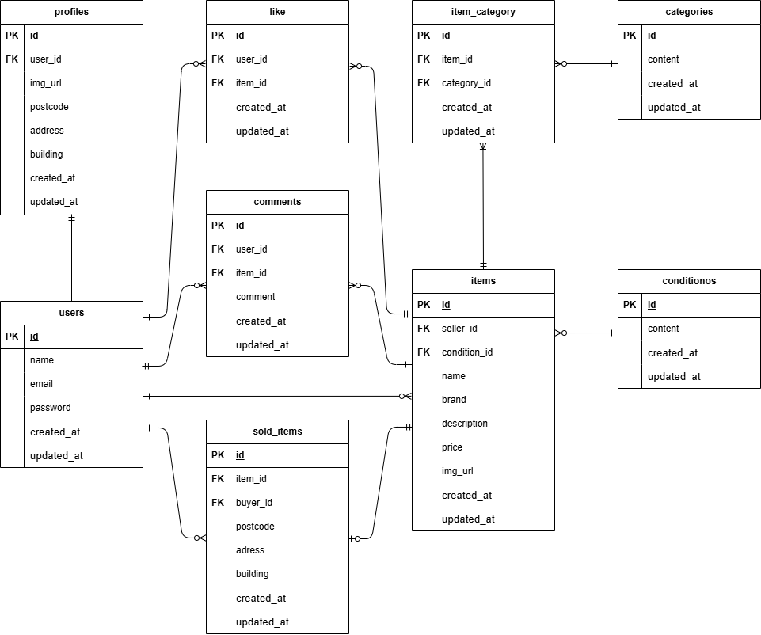

# アプリケーション名
フリーマーケットアプリ

## 環境構築

```
前提条件
* Git
* Docker
* Stripeアカウントを持っていること。
* StripeダッシュボードからAPIキー（公開可能キーとシークレットキー）を取得できること。


Dockerビルド
1. git clone git@github.com:yoshi-bell/onoe-kadai01.git
2. docker-compose up -d --build

＊MySQLは、OSによって起動しない場合があるのでそれぞれのPCに合わせてdocker-compose.ymlファイルを編集してください。

Laravel環境構築

1. docker-compose exec php bash

1. composer install

＊Stripeダッシュボード（開発者設定 -> APIキー）から、以下のキーを取得
・テスト用公開可能キー(pk_test_...)
・テスト用シークレットキー (sk_test_...)

＊.env.exampleファイルから.envを作成しstripeのAPIキーを設定しその他の環境変数も変更
・STRIPE_KEY="pk_test_xxxxxxxxxxxxxxxxxxxxxxxxxxxxxxxxxxxxxxxx"
・STRIPE_SECRET="sk_test_xxxxxxxxxxxxxxxxxxxxxxxxxxxxxxxxxxxxxxxx"

＊Stripe Webhookシークレットの取得と設定
・ターミナルにstripe CLIをインストールしログイン開始

1. stripe login

＊上記のコマンド入力後、表示されるURLをブラウザで開きStripeのログイン認証

＊Webhockの転送を開始

1.stripe listen --forward-to http://localhost/api/webhook/stripe

＊表示されたwhsec_...で始まるシークレットキーを.envファイルに設定
STRIPE_WEBHOOK_SECRET="whsec_xxxxxxxxxxxxxxxxxxxxxxxxxxxxxxxxxxxxxxxx"

1. php artisan key:generate

1. php artisan migrate

1. php artisan db:seed

＊シーディングにより、商品のダミーデータ10種類、ユーザーのダミーデータ5件がデータベースに入力されます。

＊アップロードされたファイルをWebからアクセス可能にするためシンボリックリンクを作成。

1. php artisan storage:link

＊"The stream or file could not be opened"エラーが発生した場合
srcディレクトリにあるstorageディレクトリに権限を設定

chmod -R 777 storage

```
## アプリケーションの機能

このアプリケーションは、フリマサイトを管理するためのシステムです。
主な機能は以下の通りです。
```
-   **会員登録・ログイン機能**:
    *   ユーザーはメールアドレスとパスワードで会員登録・ログインが可能です。
    *   **メール認証機能**: 新規会員登録時にメール認証を行い、未認証ユーザーは保護されたページにアクセスできません。
    *   認証メールの再送機能も備えています。
-   **商品一覧表示**:
    *   全商品の表示、商品画像、商品名、価格の表示。
    *   購入済み商品は「Sold」と表示されます。
    *   いいねした商品や購入した商品の一覧も確認できます。
-   **商品検索機能**:
    *   商品名での部分一致検索が可能です。
-   **商品詳細の確認**:
    *   商品画像、商品名、ブランド名、価格、いいね数、コメント数、商品説明、商品情報（カテゴリ、商品の状態）などを確認できます。
    *   **いいね機能**: 商品に「いいね」を付けたり解除したりできます。
    *   **コメント機能**: ログインユーザーのみがコメントを送信でき、コメントのバリデーションも実装されています。
-   **商品購入機能**:
    *   **Stripe決済**: クレジットカード決済とコンビニ決済に対応しています。
    *   **コンビニ決済**: 非同期処理に対応し、Webhookを通じて支払い完了を検知し、購入記録をデータベースに保存します。
    *   配送先住所の変更も可能です。
    *   購入した商品は「Sold」と表示され、マイページの購入履歴に追加されます。
-   **プロフィール管理**:
    *   ユーザーは自身のプロフィール（画像、ユーザー名、出品商品、購入商品）を確認できます。
    *   プロフィール画像、ユーザー名、郵便番号、住所、建物名の編集が可能です。
-   **商品出品機能**:
    *   商品画像、カテゴリ（複数選択可）、商品の状態、商品名、ブランド名、商品説明、販売価格を登録できます。
    *   商品画像のアップロード機能も備えています。
```
## 使用技術
```
・PHP 8.1.33
・Laravel 8.75
・MySQL 8.0.26
・Laravel Fortify (認証基盤)
・mailhog (メールテスト)
・Stripe (決済API)
・Stripe CLI (Webhookテスト)
```
## ER図



## URL
```
・開発環境トップページ：http://localhost/
・会員登録ページ：http://localhost/register
・ログインページ：http://localhost/login
・マイページ：http://localhost/mypage
・商品出品ページ：http://localhost/sell
・メール認証誘導画面：http://localhost/email/verify
・phpMyAdmin：http://localhost:8080/
・MailHog：http://localhost:8025
・Stripe公式サイト：https://stripe.com/jp
・Stripeテストダッシュボード：https://dashboard.stripe.com/test/dashboard
```
ディスクがWebからアクセスできるようにシンボリックリンクを作成してください。

   1     php artisan storage:link


ダミーデータユーザー
ユーザーメールアドレス
test1@example.com
test2@example.com
ユーザーパスワード
全ユーザー：usertest


stripenについて---------------------------
クレジットカード支払い時
* カード番号:
      4242 4242 4242 4242
      ( 4242 を4回繰り返します。これはテスト用のVisaカードとして認識されます。)

   * 有効期限:
      未来の日付であれば、何でも構いません。
      (例: 12 / 25)

   * CVC（セキュリティコード）:
      3桁の数字であれば、何でも構いません。
      (例: 123)


   * 名前:
      アルファベットにて任意の名前で構いません。
      (例: TEST TARO)


   4. 開発環境でのStripe CLIの使用:
       * stripe listen コマンドを再実行するたびに、新しいシークレットキーが発行されることがあ
         ります。これは、ローカル開発環境でのセキュリティを確保するためです。
       * このため、開発中に `stripe listen` を起動し直すたびに、`.env` ファイルの
         `STRIPE_WEBHOOK_SECRET` の値を更新する必要がある場合が多いです。

  これらのシナリオでキーが変更された場合は、アプリケーション側の .env
  ファイルに設定されている STRIPE_WEBHOOK_SECRET
  の値も、新しいキーに合わせて更新する必要があります。